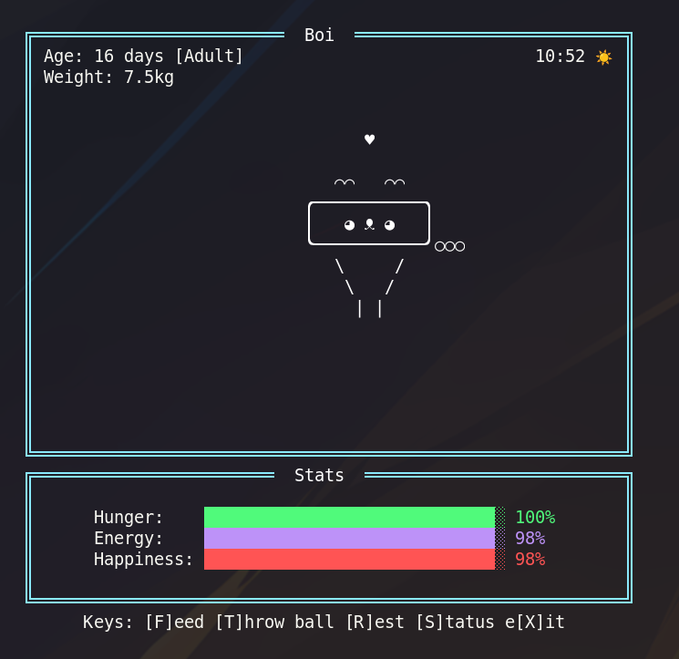
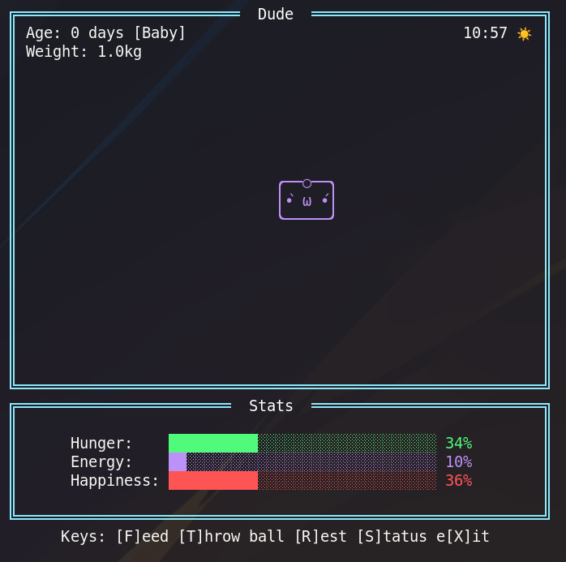
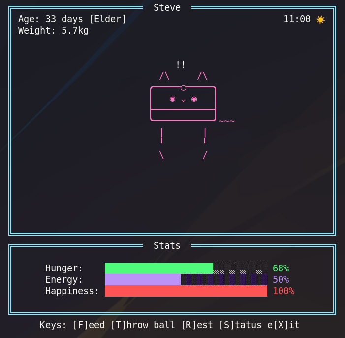

<div align="center">
  <h1>🐾 BitBuddy</h1>
</div>

<div align="center">
  <strong>A nostalgic virtual pet simulator with modern features</strong><br>
  Take care of your digital buddy in this Tamagotchi-inspired C# game
</div>

<div align="center">
  <h3>
    <a href="#features">Features</a> •
    <a href="#installation">Installation</a> •
    <a href="#usage">Usage</a> •
    <a href="#screenshots">Screenshots</a> •
    <a href="#roadmap">Roadmap</a> •
    <a href="#contributing">Contributing</a> •
    <a href="#license">License</a>
  </h3>
</div>

## ✨ Features

- **Create Your Pet**: Choose initial starting personality that alters apperanace
- **Core Pet Stats**: Manage hunger, energy, happiness, and weight metrics
- **Dynamic States**: Your pet has multiple emotional and physical states based on its needs
- **Persistence**: Saving done automatically on timer, statechange and exit
- **Offline Progression**: Pet stats continue to evolve even when you're away
- **Modular Pet Parts**: Modular parts means your pet evolves in unique ways
- **ASCII Animation**: Terminal-based visuals with color and animation

## 🚀 Installation

### Pre-built Binaries

Download the latest release for your platform:
- [Windows](https://github.com/archebus/BitBuddy/releases/latest)
- [macOS](https://github.com/archebus/BitBuddy/releases/latest)
- [Linux](https://github.com/archebus/BitBuddy/releases/latest)

### Build from Source

```bash
# Clone the repository
git clone https://github.com/yourusername/superpet.git
cd superpet

# Build with .NET
dotnet build

# Run the application
dotnet run
```

## 📝 Usage

### Commands

- `F` - Feed your pet to increase hunger and weight
- `T` - Throw a ball to your pet to play with it
- `R` - Let your pet rest to regain energy
- `S` - View detailed pet status
- `X` - Save and exit the game

### Pet Behaviors

Your pet will express different behaviors based on its current state:

- **Happy**: Content and playful, indicated by musical notes
- **Content**: Full belly and relaxed, showing hearts
- **Excited**: Super happy and energetic, shown with exclamation marks
- **Hungry**: Looking for food, marked by question marks
- **Tired**: Low on energy, displaying Z's
- **Bored**: Needing stimulation, shown with ellipses
- **Sleeping**: Replenishing energy, animated with Z's

## 📸 Screenshots

### Terminal Version
<div align="center">
  
  
  
</div>

## 🗺️ Roadmap

- [x] Core pet simulation mechanics
- [x] Terminal-based UI
- [x] Save/load functionality
- [x] Modular pet creation (legs, ears, tail)
- [ ] Mini-games for increased interaction
- [ ] Pet personalities and traits
- [ ] Achievement system
- [ ] Console beep effects
- [ ] Death state, pet illness

## 💻 Technical Details

SuperPet is built with:
- C# (.NET 8.0)
- State Pattern for pet behavior
- JSON serialization for save data

### Architecture

```
SuperPet/
├── assets/        # Screenshots and images for repo
├── model/         # Core pet data models and state implementations
├── renderer/      # Display and UI components
├── persistance/   # Save/load systems
├── Program.cs     # Application entry point
└── Game.cs        # Main game loop and management
```

## 🤝 Contributing

Contributions are welcome! Please feel free to submit a Pull Request.

1. Fork the repository
2. Create your feature branch (`git checkout -b feature/amazing-feature`)
3. Commit your changes (`git commit -m 'Add some amazing feature'`)
4. Push to the branch (`git push origin feature/amazing-feature`)
5. Open a Pull Request

## 📄 License

This project is licensed under the MIT License - see the [LICENSE](LICENSE) file for details.

## 🙏 Acknowledgements

- Inspired by Tamagotchi and other virtual pets of the 90s
- Thanks to my step daughter Allie for letting me play with her tamagotchi
- Built with love and nostalgia
